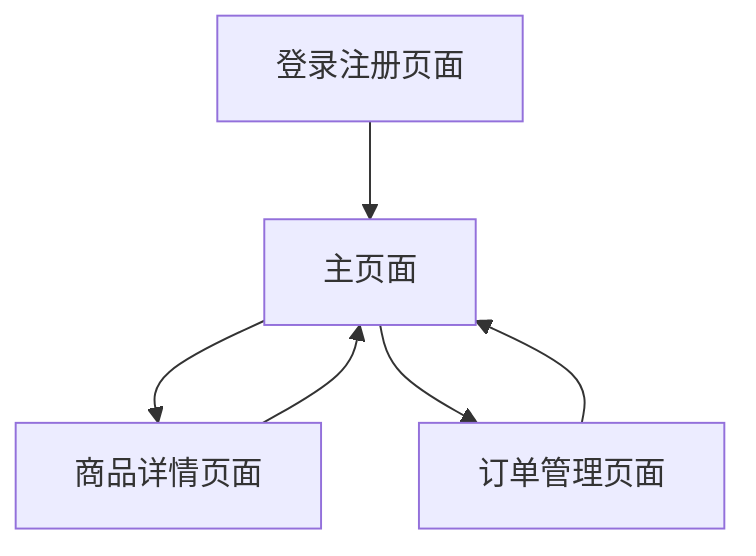

# Centery App 产品需求文档

## 1. 产品概述

Centery App 是一个基于 Cloudflare Workers 的极简在线下单系统，采用 Astro + TailwindCSS 构建前端，实现用户注册登录、商品浏览、订单管理等核心功能。

* 解决小型商户快速搭建在线订单系统的需求，提供轻量级、高性能的解决方案

* 目标用户为需要简单订单管理的小型商户和个人卖家

## 2. 核心功能

### 2.1 用户角色

| 角色   | 注册方式    | 核心权限                |
| ---- | ------- | ------------------- |
| 普通用户 | 用户名密码注册 | 浏览商品、下单、管理个人订单和收货地址 |

### 2.2 功能模块

本系统包含以下主要页面：

1. **登录注册页面**：用户认证、账户创建
2. **主页面**：商品浏览Tab、我的订单Tab切换
3. **商品详情页面**：商品信息展示、库存查看、下单操作
4. **订单管理页面**：个人信息、收货地址管理、订单历史

### 2.3 页面详情

| 页面名称   | 模块名称    | 功能描述                 |
| ------ | ------- | -------------------- |
| 登录注册页面 | 用户认证    | 用户名密码登录、新用户注册、表单验证   |
| 主页面    | 商品浏览Tab | 商品列表展示、搜索筛选、商品卡片点击跳转 |
| 主页面    | 我的订单Tab | 订单列表、订单状态、快速操作入口     |
| 商品详情页面 | 商品信息    | 商品图片、名称、价格、库存、详细描述展示 |
| 商品详情页面 | 下单操作    | 数量选择、立即下单、收货地址选择     |
| 订单管理页面 | 个人信息    | 用户名显示、密码修改、账户设置      |
| 订单管理页面 | 地址管理    | 收货地址增删改查、默认地址设置      |
| 订单管理页面 | 订单历史    | 历史订单查看、订单详情、订单状态跟踪   |

## 3. 核心流程

**用户注册登录流程：**
用户访问系统 → 选择注册/登录 → 填写用户名密码 → 系统验证 → 进入主页面

**商品浏览下单流程：**
主页面商品浏览 → 点击商品卡片 → 商品详情页面 → 选择数量和收货地址 → 确认下单 → 订单创建成功

**订单管理流程：**
主页面我的订单Tab → 查看订单列表 → 点击订单详情 → 管理收货地址 → 更新个人信息



## 4. 用户界面设计

### 4.1 设计风格

* **主色调**：绿色系 (#16ff8c) 作为主色，灰色系 (#f0f0f0) 作为辅助色

* **按钮样式**：圆角按钮，支持悬停和点击状态

* **字体**：系统默认字体，标题 18px，正文 14px，小字 12px

* **布局风格**：卡片式布局，顶部导航，移动优先的响应式设计

* **图标风格**：简洁线性图标，统一视觉风格

### 4.2 页面设计概览

| 页面名称   | 模块名称  | UI元素                        |
| ------ | ----- | --------------------------- |
| 登录注册页面 | 认证表单  | 居中卡片布局，输入框圆角设计，蓝色主按钮，表单验证提示 |
| 主页面    | Tab导航 | 顶部固定Tab切换，蓝色激活状态，平滑过渡动画     |
| 主页面    | 商品列表  | 网格布局商品卡片，商品图片、名称、价格展示，悬停效果  |
| 商品详情页面 | 商品展示  | 大图展示，信息卡片布局，库存状态标识，下单按钮突出   |
| 订单管理页面 | 信息管理  | 分组卡片布局，清晰的信息层级，操作按钮右对齐      |

### 4.3 响应式设计

移动优先设计，桌面端适配。支持触摸交互优化，确保在各种屏幕尺寸下的良好体验。

## 5. 技术架构

### 5.1 前端技术栈

* **框架**：Astro (静态站点生成)

* **样式**：TailwindCSS (原子化CSS)

* **部署**：Cloudflare Workers

* 尤其注意说明：目前Cloudflare官方推荐将静态资产（HTML、CSS、图像和其他文件）作为 Worker 的一部分上传，而非原有Pages旧模式，Cloudflare 将处理缓存并将其提供给 Web 浏览器，相关使用必须参考：\`<https://developers.cloudflare.com/workers/static-assets/>\`

### 5.2 后端技术栈

* **运行时**：Cloudflare Workers

* **数据库**：Cloudflare D1 (用户数据)

* **外部API**：飞书多维表格 (商品和订单数据)

### 5.3 数据库设计

**用户表 (users)**

```sql
CREATE TABLE users (
  id INTEGER PRIMARY KEY AUTOINCREMENT,
  username TEXT UNIQUE NOT NULL,
  password_hash TEXT NOT NULL,
  notes TEXT,
  created_at DATETIME DEFAULT CURRENT_TIMESTAMP,
  updated_at DATETIME DEFAULT CURRENT_TIMESTAMP
);
```

**收货地址表 (addresses)**

```sql
CREATE TABLE addresses (
  id INTEGER PRIMARY KEY AUTOINCREMENT,
  user_id INTEGER NOT NULL,
  recipient_name TEXT NOT NULL,
  phone TEXT NOT NULL,
  address TEXT NOT NULL,
  is_default BOOLEAN DEFAULT FALSE,
  created_at DATETIME DEFAULT CURRENT_TIMESTAMP,
  FOREIGN KEY (user_id) REFERENCES users(id)
);
```

### 5.4 API设计

**用户认证API**

* `POST /api/auth/register` - 用户注册

* `POST /api/auth/login` - 用户登录

* `POST /api/auth/logout` - 用户登出

**用户管理API**

* `GET /api/user/profile` - 获取用户信息

* `PUT /api/user/profile` - 更新用户信息

* `GET /api/user/addresses` - 获取收货地址列表

* `POST /api/user/addresses` - 添加收货地址

* `PUT /api/user/addresses/:id` - 更新收货地址

* `DELETE /api/user/addresses/:id` - 删除收货地址

**商品API (飞书集成脚手架)**

* `GET /api/products` - 获取商品列表

* `GET /api/products/:id` - 获取商品详情

**订单API (飞书集成脚手架)**

* `POST /api/orders` - 创建订单

* `GET /api/orders` - 获取用户订单列表

* `GET /api/orders/:id` - 获取订单详情

### 5.5 环境变量配置

```
# Cloudflare D1 数据库
DB = "centery-app-db"

# 飞书API配置 (待后续配置)
FEISHU_APP_ID = "your_app_id"
FEISHU_APP_SECRET = "your_app_secret"

# JWT密钥
JWT_SECRET = "your_jwt_secret"
```

## 6. 开发计划

### 第一阶段 (当前)

1. 项目初始化和D1数据库创建
2. 用户注册登录功能完整实现
3. 商品浏览和订单管理前端界面搭建

### 第二阶段 (后续)

1. 飞书多维表格集成
2. 商品管理后端逻辑
3. 订单处理完整流程
4. 系统优化和部署

